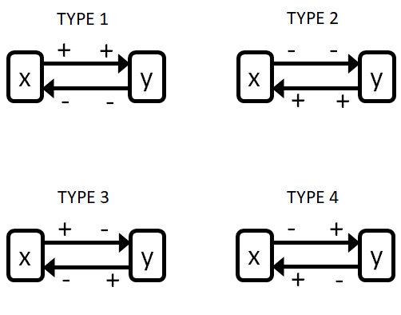
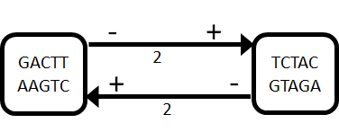
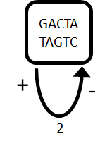
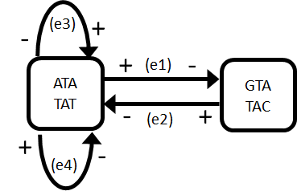
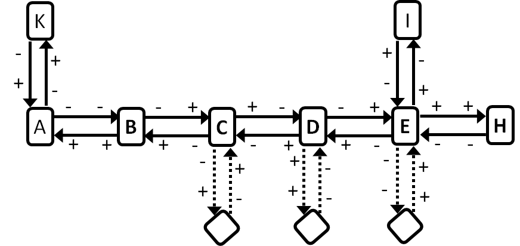

# Bi-Directed Graphs in BCALM 2

In the publications describing BCALM 2 [[Chikhi et al. 2017](https://doi.org/10.1093/bioinformatics/btw279), [Chikhi et al. 2014](http://arxiv.org/abs/1401.5383)], we describe how BCALM 2 works in the directed graph model. However, BCALM 2 uses the [bi-directed graph](https://en.wikipedia.org/wiki/Bidirected_graph) model, which we did not describe in the paper for the sake of brevity. The bi-directed graph model is a natural extension of the directed graph and has been widely used; but, it can be tricky to understand for newcomers and remains a source of confusion even to experts. In this document, we describe the details of how BCALM 2 works with bi-directed graphs. 

## Bi-directed graphs

There are several ways of representing bi-directed graphs. Here we describe the way BCALM 2 represents them.  An edge in a bi-directed graph e is 5-tuple  (e.from, e.to, e.fromSign, e.toSign, e.label).  The e.from and e.to are vertices, and we interpret these naturally as saying that the *direction* of e is from e.from to e.to.  The e.fromSign and e.toSign can take on either the value '+' or '-'.  The e.label is an arbitrary identifier. Note that there can be multiple edges of the same type as long as the labels are different, i.e. there can be edges (x, y, +, -, "lbl1" ) and (x, y, +, -, "lbl2").  We can visualize these edges, e.g. (x, y, -, +, "lbl1"):

Note that we draw the fromSign next to the "from" vertex, and the toSign next to the "to" vertex. In other words, the following graph is equivalent to the one above:

The label can be omitted if not important. Given two nodes x and y, there are 8 types of edges that can connect them.  There are two possible directions for the edge, two possible fromSigns, and two possible toSigns.  However, each edge has a *mirror edge* going in the opposite direction. Mirrors are defined according to this table:

| Mirror Type | Edge | Edge |
| :-: | :-: | :-: | 
| 1 | (x, y, +, +) | (y, x, -, -) |
| 2 | (x, y, -, -) | (y, x, +, +) |
| 3 | (x, y, +, -) | (y, x, +, -) |
| 4 | (x, y, -, +) | (y, x, -, +) |

The table contains the 8 edge types, organized such that each row lists a pair of edges that are mirrors of each other. Each pair is given a *mirror type* number for the purposes of our discussion, but the  numbers are arbitrary. We can also visualize the four mirror types as follows:

Bi-directed graphs have the constraint that, given two nodes x and y, a label l, and a mirror type, either both or none of the mirror edges with label l exist between x and y. Informally, edges always come in identically-labeled pairs (with one exception listed below). Thus, even though  there are 8 type of edges that can be between x and y, there are really only 4 types of *connections*.  There are alternate representations of bi-directed graphs that remove this redundancy, but we do not describe them here.

The above rule has an interesting effect on self-loops (i.e. when e.from = e.to). In such cases, observe that the two mirror edges of Type 3 are identical. The same holds for Type 4.  We refer to such edges as *self-mirrors*. A bi-directed graph does not allow to represent duplicate edges, and so this connection is represented by only one edge. This case forms an exception to the rule that all edges come in pairs with their mirror. I suspect that this special case has cost humanity thousand of hours in debugging time. 

## Bi-directed (exact) overlap graphs

Bi-directed graphs are a natural way of representing the double-stranded nature of overlaps between DNA strings. A *node* x in a bi-directed overlap graph represents a pair of strings, where one is the reverse-complement of the other.  One of the strings is arbitrarily chosen as the label of the node and denoted as x.label. Given a string s, we let rc(s) denote its reverse-complement. Visually, we draw a node using both a label and its reverse-complement, with the convention that the label is always on top. For example, we can draw a node with label GACTT as:

 Each bi-directed edge has the following interpretation in terms of label  overlaps:

| fromSign | toSign | overlap |
|:----------: | :-----: | -| 
| + | + | suffix of e.from.label = prefix of e.to.label |
| + | - | suffix of e.from.label = prefix of rc(e.to.label) |
| - | + | suffix of rc(e.from.label) = prefix of e.to.label |
| - | - | suffix of rc(e.from.label) = prefix of rc(e.to.label) | 

We label each edge with the length of the equal suffixes/prefixes. For example, let x.label = GACTT and y.label = TCTAC. (We note that in some applications, the match between the suffix and prefix does not have to be exact; for our purposes we will focus on the exact case.) According to the above table, there are two types of overlaps between x and y. The last 2 characters of rc(x.label) are equal to the first two characters of y.label, and the last two characters of rc(y.label) are equal to the first two characters of x.label. These two overlaps can be represented using two edges:

Intuitively, an edge implies that the strings of the two nodes can be combined, using an overlap, into a bigger string. The sign at a node indicates whether the label or the label's reverse-complement is used. A '+' indicates that the label is used, while a '-' indicates that the label's reverse-complement is used. 

Notice that the two overlaps between the nodes in the previous example are mirror edges of type 4. This is not a coincidence. One can show from the properties of reverse-complements that if there is an overlap implied by an  edge, then there must also be an overlap implied by the mirror of that edge. 

In this context, a self-mirror edge corresponds to a situation where either a suffix or a prefix of a node is equal to its own reverse-complement. Here is an example of a Type 3 self-mirror. Note that a self-mirror cannot have an overlap with an odd length, because an odd-length string can never be its own reverse-complement.

## Bidirected de-Bruijn graph

Given a set of strings S, a *[node-centric](https://www.biostars.org/p/175058/#256741) bi-directed de-Bruijn graph of order k* is a type of bi-directed overlap graph. The nodes correspond to all the distinct k-mer substrings of S, with the caveat that two k-mers that are reverse-complements of each other are represented by a single node. The label of this node is chosen arbitrarily as either the k-mer or its reverse complement; however there is often a convention that the label is chosen as the lexicographically smallest option. The edges correspond to all the overlaps of length k-1. For example, with k = 3 and S={GTATAC}, the graph is:

Here, we gave each edge a name (e.g. e1) so that we can refer to the edges below. Observe that e1 and e2 are mirror edges, while e3 is a self-mirror and e4 is a self-mirror.

## Walks and unitigs and compaction
A sequence of edges e_1, ... , e_n in a bi-directed graph is *walk* if 
* It is a walk in the directed sense, i.e. e_i.to = e_{i+1}.from, for all 0 < i < n.
* The signs at an internal vertices are equal, i.e. e_i.toSign = e_{i+1}.fromSign, for all 0 < i < n.

A single vertex is also considered a walk. In the previous graph example, the sequence (e2, e3, e4, e3, e1) is a walk, while (e2, e3, e4, e1) is not.

In a bi-directed overlap graph, a walk spells a corresponding string. For example, (e2, e3, e1) spells the original string GTATAC, while (e3, e1) spells TATAC. Observe that each walk has a corresponding *mirror walk* which spells the reverse-complement. For example, the mirror walk of (e3, e1) is (e2, e3) and spells GTATA.

Given a walk (e_1, ..., e_n), let v_0 = e_1.from and v_i = e_i.to, for all 1 <= i <= n. A walk is a *unitig* if it is either a single vertex or a path (i.e. does not repeat vertices) such that
* for every 0 < i < n, the only edges incident on v_i are e_{i-1}, e_i,  and their mirrors.
* e_1 is the only outgoing edge from v_0 that has the the sign e_1.fromSign at v_0,
* e_n is the only incoming edge to v_n that has the sign e_n.toSign at v_n.

A unitig is *maximal* if it cannot be extended in either direction. Consider the graph defined by the rectangular nodes and solid edges below (i.e. discarding the rhombus-shaped nodes and dashed edges for now), In this graph, there is a maximal unitig traversing (B, C, D, E). There is also a mirror maximal unitig traversing (E, D, C, B). There are also 4 other maximal unitigs: (A), (H), (K), and (I). The rhombus-shaped nodes and dashed edges represent nodes and edges that, if added  to the graph, would destroy the unitig (B, C, D, E) and its mirror.

It can be shown that maximal unitigs form a vertex decomposition of the graph (though I have not seen a proof of this statement). In the *compacted* bi-directed graph, every maximal unitig and its mirror is replaced by a single vertex. Formally, the nodes of the compacted graph are the maximal unitigs, and the edges represent all overlaps of length k-1.

## BCALM 2 
BCALM 2 computes the compacted bi-directed node-centric de Bruijn graph of order k from its input. The output is in two formats. In the FASTA output file of BCALM 2, every FASTA entry corresponds to a node. An edge e is represented in the header of node e.from as `L:<e.fromSign>:<e.to>:<e.toSign>`. Note that BCALM 2 records all edges, even though, in principle,  one could record only one edge per mirror type. 

BCALM 2 also supports [GFA1.0](https://github.com/GFA-spec/GFA-spec/blob/master/GFA1.md) output format. A unitig is represented as a "Segment," and each edge corresponds to exactly one "Link."  The "Link" concept in GFA is identical to the way we have defined edges here.

